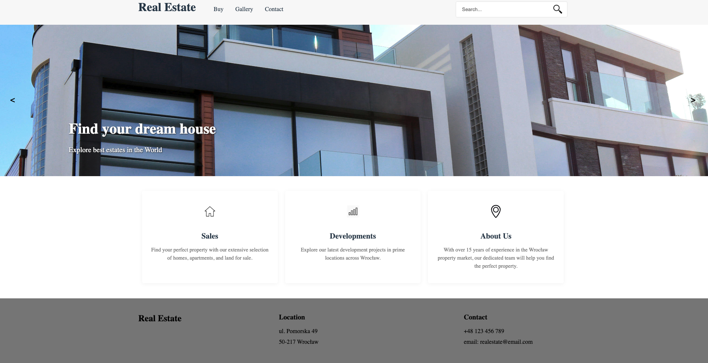

# Real Estate Page

A responsive web application for browsing and filtering real estate properties including apartments, houses, and land plots.

## Description

This project is a comprehensive real estate website that allows users to:

- Browse different types of properties (apartments, houses, land)
- Filter properties by price, area, and number of rooms
- Search for specific properties using the search function
- Navigate through multiple listings using pagination
- Image gallery
- Contact the real estate agency through a dedicated contact page

The website is fully responsive and works across desktop, tablet, and mobile devices.

## Visuals



## Installation

```bash
# Clone the repository
git clone https://autocode.git.epam.com/YOUR-USERNAME/YOUR-REPO-NAME.git

# Navigate to the project directory
cd YOUR-REPO-NAME

# Install dependencies
npm install
```

## Setup

The project was initialized using npm init -y

Sass was added using npm install sass --save-dev

A .gitignore file was created with node_modules added to prevent tracking

Compilation scripts were added to package.json:

```json
"scripts": {
  "compile": "sass src/scss:src/css",
  "watch": "sass --watch src/scss:src/css"
}
```

To run the development server:

```bash
npx serve src
```

### Prerequisites

- Node.js (v14 or higher recommended)
- npm (v6 or higher recommended)
- Git

## Project Structure

```
├── src/
│   ├── buySection/              # Property category pages
│   │   ├── apartments.html
│   │   ├── houses.html
│   │   └── land.html
│   ├── css/                     # Compiled CSS files
│   ├── data/                    # JSON data files
│   │   └── estate.json          # Property listings data
│   ├── images/                  # Image assets
│   │   ├── apartments/
│   │   ├── houses/
│   │   ├── lands/
│   │   └── icons/
│   ├── js/                      # JavaScript files
│   │   ├── displayApartments.js # Property display logic
│   │   ├── handleSearch.js      # Search functionality
│   │   ├── handleSlider.js      # Image slider functionality
│   │   └── handleClick.js       # Event handling
│   ├── scss/                    # SCSS source files
│   │   ├── _variables.scss
│   │   ├── _mixins.scss
│   │   ├── _header.scss
│   │   ├── _footer.scss
│   │   ├── _property-card.scss
│   │   └── main.scss
│   ├── index.html               # Homepage
│   ├── contact.html             # Contact page
│   └── gallery.html             # Property gallery
└── package.json                 # Project configuration
```

## Features

- **Property Listings**: Browse through various properties categorized by type
- **Search Functionality**: Find properties by keywords
- **Advanced Filtering**: Filter properties by price range, number of rooms, and area
- **Sorting Options**: Sort properties by price (high to low, low to high) and area
- **Responsive Design**: Optimized for all device sizes
- **Interactive Image Slider**: Showcase featured properties
- **Dynamic Pagination**: Navigate through large sets of property listings
- **Contact Form**: Get in touch with the real estate agency

## Usage

Navigate to different property types using the navigation menu:

- Apartments
- Houses
- Land

Use the search bar to find properties by keyword.

Filter properties using the filter button to refine results by:

- Price range
- Number of rooms
- Area size

## Roadmap

Future enhancements planned for this project:

- Add user authentication for saving favorite properties
- Implement a map view for property locations
- Add property comparison functionality
- Add rental properties
- Add "Show Details" button on the property card
- Create a mortgage calculator
- Integrate with a backend API for dynamic data

## Contributing

1. Fork the Project
2. Create your Feature Branch (`git checkout -b feature/AmazingFeature`)
3. Commit your Changes (`git commit -m 'Add some AmazingFeature'`)
4. Push to the Branch (`git push origin feature/AmazingFeature`)
5. Open a Pull Request

## Authors and Acknowledgment

- Patryk Pacholski

## License

This project is licensed under the MIT License - see the LICENSE file for details.

## Project Status

Active development - Features are being added regularly.
